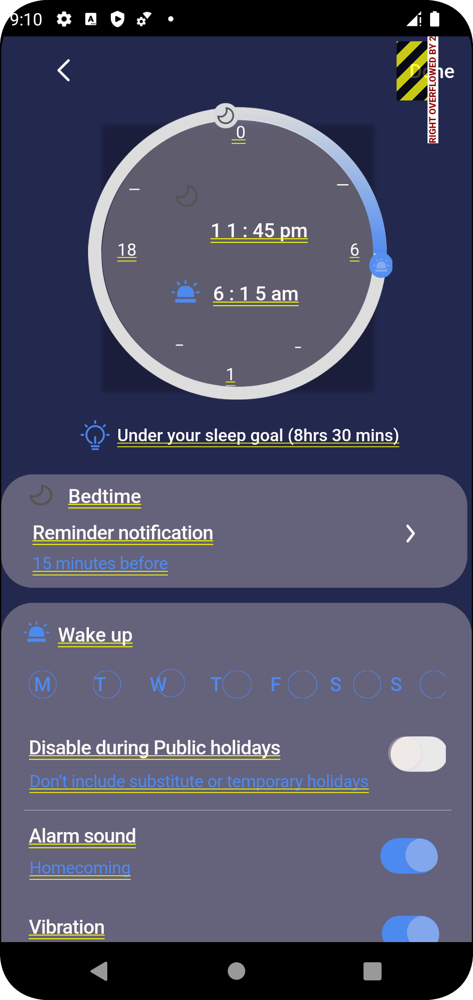
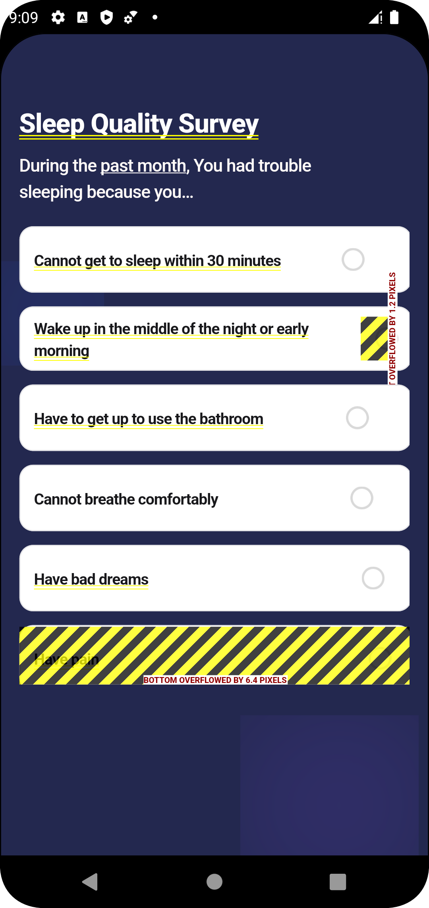
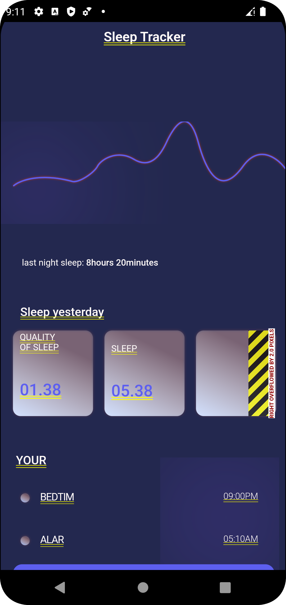
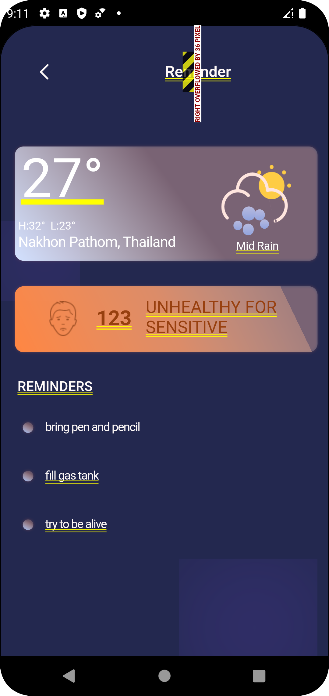
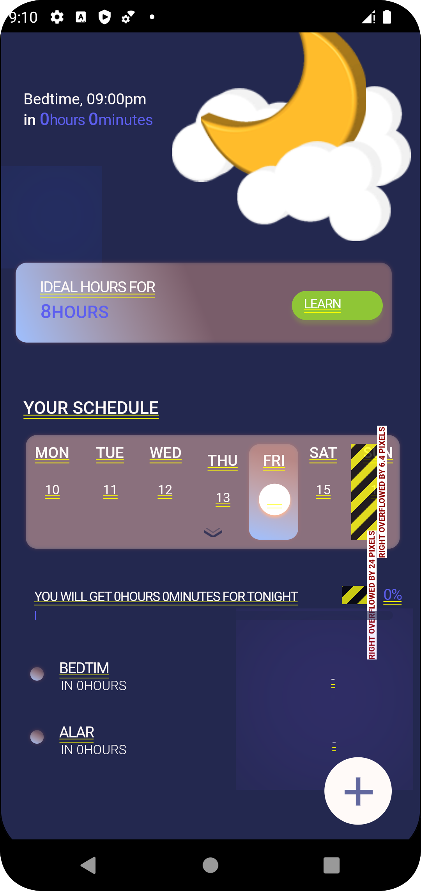
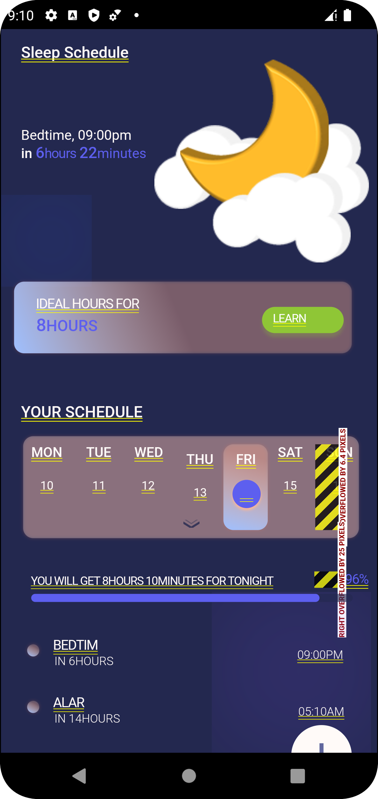

# sleep_tracker_prototype
Project name : Rest Right

## Member : 

Apiwit Chonkitgosol 6280561

Yossatorn Phithakjiraroj 6280942

The Rest Right mobile app is designed to help users track their sleep and improve their overall sleep quality. The app offers several features, including a sleep tracker, snore tracker, to-do list, and weather information.

## Pain Points :

Sleep is essential to maintaining good health and well-being, yet many people struggle with getting quality rest. Rest Right addresses the following pain points:
- Lack of sleep tracker: Many people struggle to track their sleep patterns and understand how they affect their health.
- Snoring: Snoring can disrupt sleep and lead to health issues.
- Forgetting tasks: People often have busy schedules and struggle to remember important tasks or to-do lists.
- Air quality and weather: These factors can affect sleep quality, but many people do not have an easy way to monitor them.

## Features :

Rest Right offers several features to address the pain points mentioned above:

- Anonymous users: Anonymous users can use the app to set an alarm and wake up at their desired time. They can also input their age, and the app will calculate the recommended sleep hours based on their age group.
- Logged-In users: Logged-in users can access additional features, such as a survey to help them understand their sleep patterns and how to improve them. They can also use the snore tracker to monitor their snoring and receive reminders for important tasks through the to-do list feature. Additionally, they can check weather and AQI information to plan for better sleep conditions.

## Target Audience :

The Rest Right app is designed for individuals who want to track their sleep patterns and improve their sleep quality. This includes people who struggle with snoring, have difficulty remembering important tasks, and are concerned about the impact of air quality and weather on their sleep.

##Conclusion :

Rest Right is a mobile app that addresses common sleep-related pain points and helps users improve their sleep quality. With its easy-to-use features and personalized recommendations, Rest Right is an essential tool for anyone looking to achieve better sleep.

## API + Firebase :

User authentication ( Firebase )
The Rest Right app integrates with two APIs to provide weather and AQI information:
- The Thai Meteorological Department Weather Warning News API: This API provides up-to-date information on weather conditions in Thailand, including rain and cloud cover.
https://data.go.th/dataset/https-data-tmd-go-th-api-weatherwarningnews-v1-uid-demo-ukey-demokey
- The Thailand Pollution Control Department PM10 API: This API provides information on PM10 levels, which can affect air quality and sleep.
https://data.go.th/dataset/pm10
If time permits, Rest Right will also integrate with the IQAir Air Pollution Data API ( https://www.iqair.com/th/air-pollution-data-api ), which provides comprehensive air quality data from around the world. Rest Right will also use the Google Fit REST API to access fitness and wellness data from Google Fit.

## Screenshots

|              setAlarm              |                Survey                |              Tracker              |
|:-------------------------------:|:---------------------------------------:|:---------------------------------:|
|  |  |  |

|               Reminder                |                Alarm                 |                 Alarm (settime)                 |
|:-------------------------------------------:|:---------------------------------------------:|:-----------------------------------------------:|
|  |  |  |
